# Laporan Analisis Data Universitas Amerika Serikat

## PENDAHULUAN
Menggunakan data `universities.csv`, laporan ini bertujuan untuk menganalisis lanskap pendidikan tinggi di Amerika Serikat. Dataset ini mencakup berbagai metrik penting dari sejumlah universitas, mulai dari data demografis, jenis institusi (negeri vs swasta), biaya pendidikan (*tuition*), hingga indikator performa akademik seperti tingkat kelulusan. Analisis ini difokuskan untuk memahami distribusi tipe universitas, hubungan antara biaya yang dikeluarkan dengan tingkat kelulusan, serta mengidentifikasi wilayah geografis dengan biaya hidup paling terjangkau bagi mahasiswa.

## PREPARATION
Tahap ini berfokus pada pembersihan dan penyesuaian tipe data agar siap diolah:
1.  **Handling Missing Data:** Mengisi nilai yang hilang (*missing values*) pada kolom bertipe integer dan float menggunakan nilai median untuk menjaga distribusi data.
    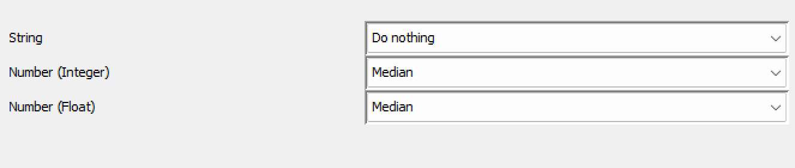
2.  **Column Renaming:** Mengubah nama kolom `Public (1)/ Private (2)` menjadi `Category` agar lebih mudah dibaca.
    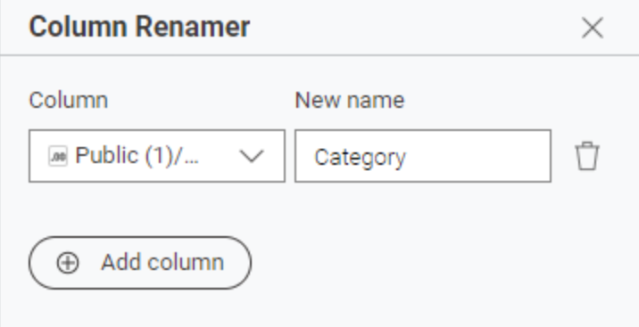
3.  **Data Type Conversion:** Menggunakan node *Rule Engine* untuk mengubah nilai indeks `1` menjadi "Public" dan `2` menjadi "Private", sehingga dapat dikategorikan dalam visualisasi.
    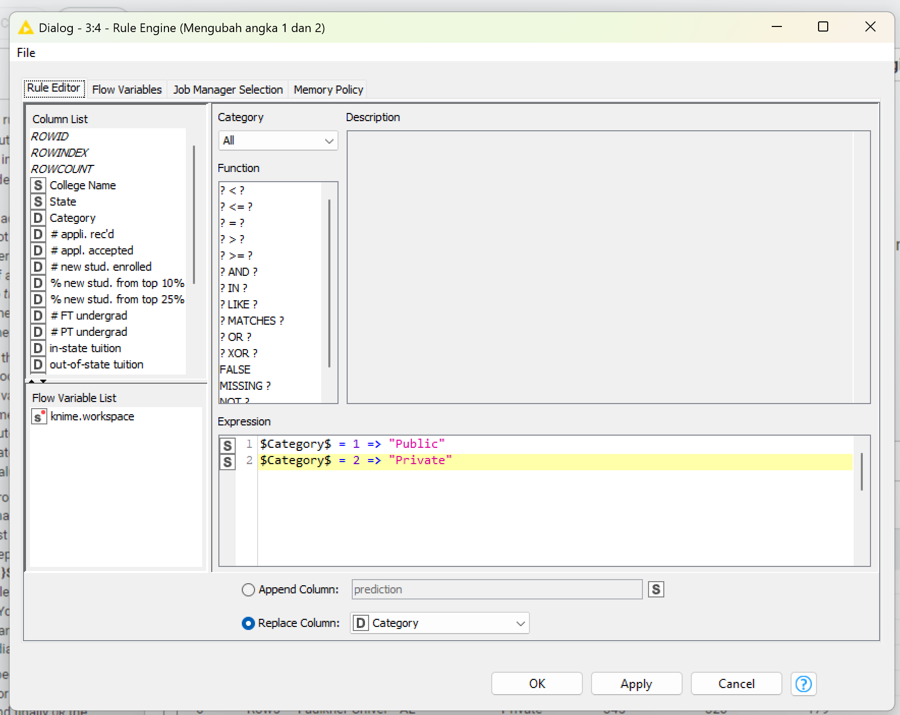

## PROCESSING
Tahap pengolahan data (data processing) ini dilakukan secara sistematis untuk mentransformasi data mentah menjadi format yang siap untuk divisualisasikan, dengan rincian langkah sebagai berikut:
*  **Feature Engineering:** Pada tahap ini, dilakukan manipulasi matematis menggunakan node Math Formula untuk menciptakan variabel baru yang lebih informatif bagi analisis:
    1.  **Pembuatan Kolom `Living_Cost`:** Variabel ini dibuat untuk merepresentasikan estimasi total biaya hidup non-akademik mahasiswa. Nilainya diperoleh dengan menjumlahkan komponen biaya tempat tinggal (*room*), biaya makan (*board*), dan biaya tambahan lain-lain (*add. fees*) menggunakan rumus: `$room$ + $board$ + $add. fees$`.
        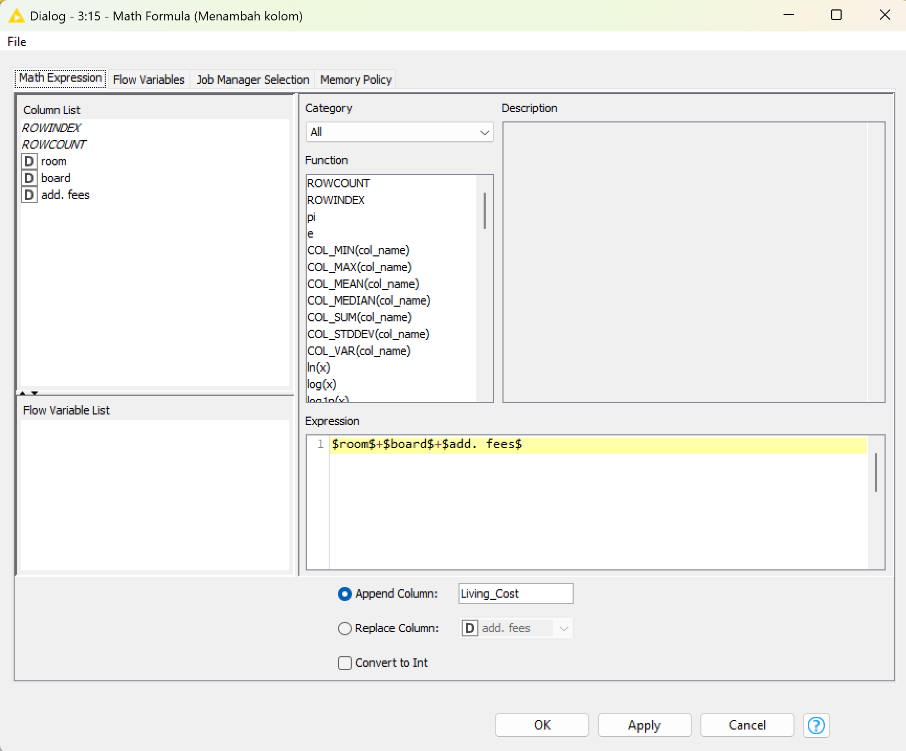
   2.   **Pembuatan Kolom `Average_Tuition`:** Variabel ini bertujuan untuk mendapatkan nilai tengah biaya kuliah. Dihitung dengan mengambil rata-rata antara biaya kuliah warga lokal (*in-state*) dan pendatang (*out-of-state*) menggunakan rumus: `($in-state tuition$ + $out-of-state tuition$) / 2`.
    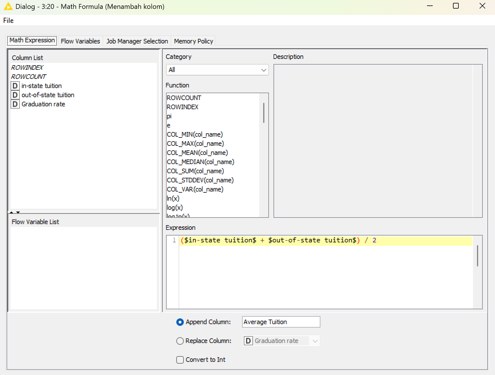
*  **Color Management:** Langkah ini berfokus pada estetika dan keterbacaan visualisasi. Menggunakan node Color Manager, data diklasifikasikan berdasarkan jenis universitasnya. Skema warna ditetapkan secara spesifik—Biru untuk Universitas Negeri (Public) dan Hijau untuk Universitas Swasta (Private). Pemberian warna ini krusial agar pada saat ditampilkan dalam Scatter Plot, pola sebaran antara kedua jenis institusi tersebut dapat dibedakan dengan mudah dan cepat.
    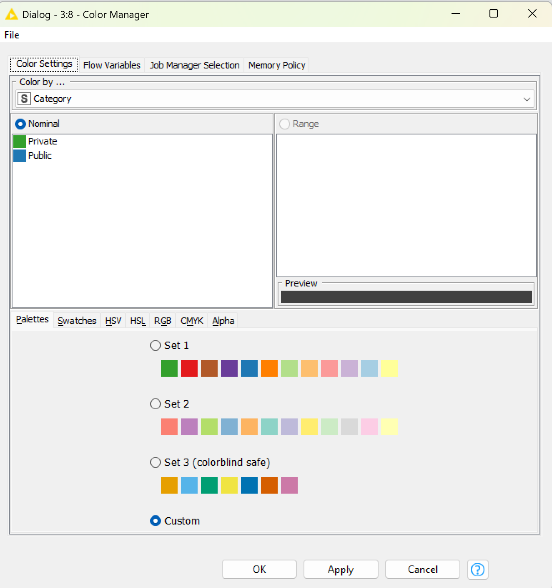
*  **Aggregation (Untuk Bar Chart):** Proses ini mengubah level analisis dari "per Universitas" menjadi "per Wilayah". Menggunakan node GroupBy, data dikelompokkan berdasarkan kolom `State` (Negara Bagian). Selanjutnya, dilakukan operasi statistik untuk menghitung nilai rata-rata (mean) dari kolom `Living_Cost` yang telah dibuat sebelumnya. Hasilnya adalah satu baris data untuk setiap negara bagian yang memuat rata-rata biaya hidup di wilayah tersebut.
    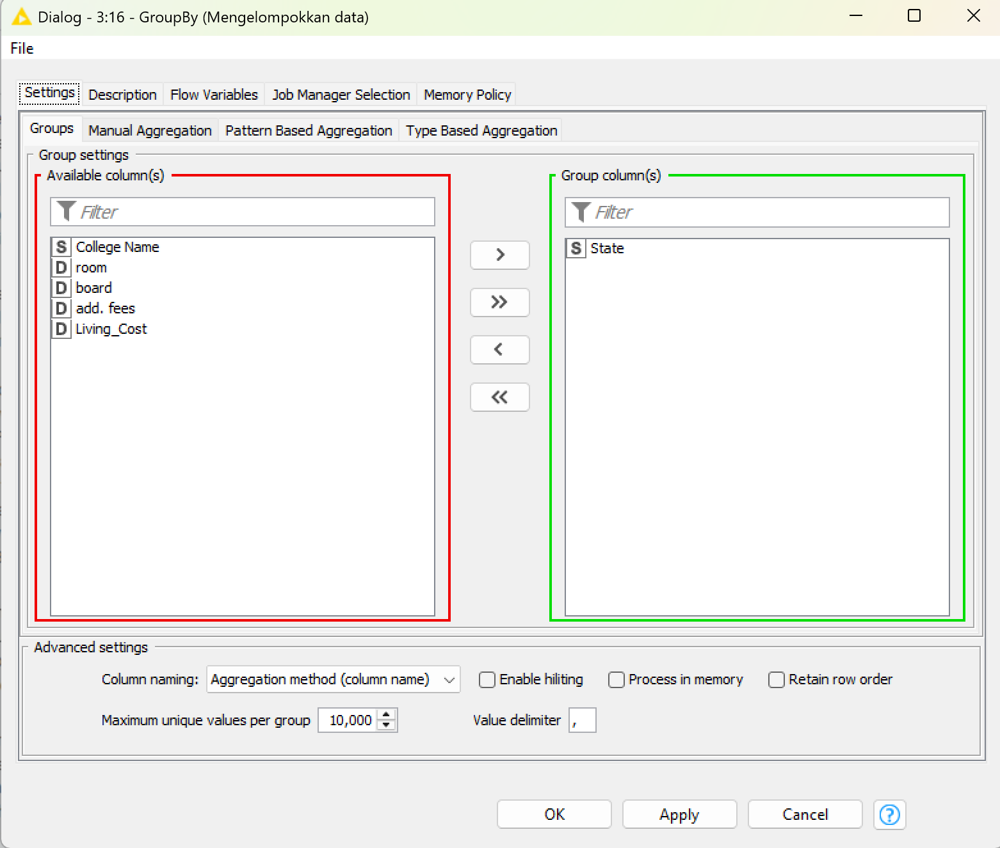
*  **Sorting & Filtering:** Ini adalah langkah final untuk menyaring informasi utama (Top Insights). Pertama, node Sorter digunakan untuk mengurutkan data hasil agregasi biaya hidup dari yang terkecil ke terbesar (Ascending). Setelah data terurut, node Row Filter diaplikasikan untuk memotong data dan hanya mengambil 10 baris teratas. Langkah ini memastikan bahwa visualisasi akhir hanya akan menampilkan 10 negara bagian dengan rata-rata biaya hidup terendah (termurah).
    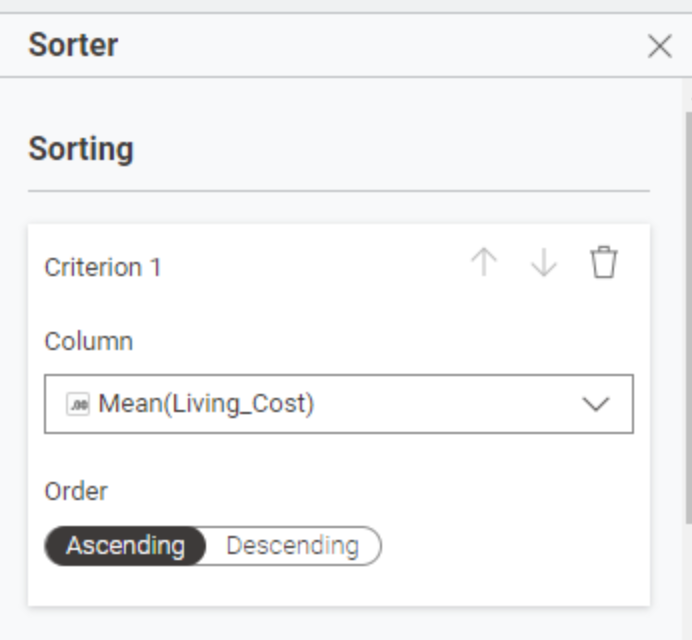

## VISUALISASI DAN INSIGHT
Berikut adalah instrumen visualisasi yang digunakan dalam workflow:
1. **Pie Chart:** Memvisualisasikan proporsi perbandingan jumlah antara universitas swasta (*Private*) dan negeri (*Public*).
  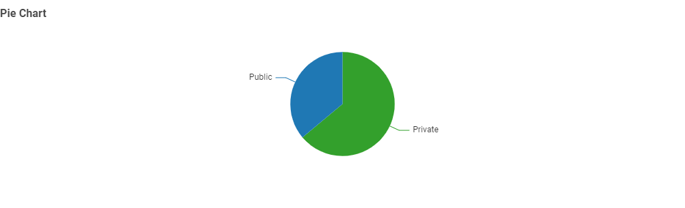
  **Insight:** Berdasarkan Pie Chart, populasi universitas di Amerika Serikat didominasi oleh universitas swasta (*private*) dibandingkan universitas negeri (*public*). Hal ini menunjukkan banyaknya opsi institusi pendidikan mandiri yang tersedia di pasar pendidikan AS.
   
2. **Scatter Plot:** Memetakan hubungan korelasi antara variabel `out-of-state tuition` (X) dengan `Graduation rate` (Y), dengan pembedaan warna berdasarkan kategori universitas.
  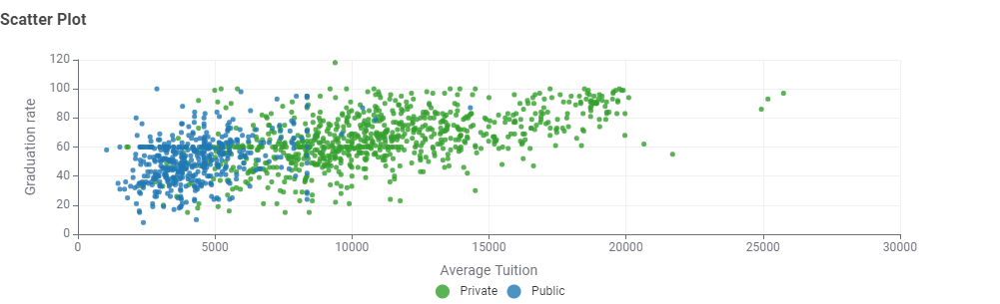
  **Insight:** Analisis Scatter Plot menunjukkan adanya **korelasi positif** antara biaya kuliah dan tingkat kelulusan.
* **Institusi Swasta (Hijau):** Mendominasi area biaya tinggi (di atas $15,000) namun juga menguasai tingkat kelulusan tertinggi (di atas 80-90%). Ini menunjukkan bahwa biaya premium sering kali berbanding lurus dengan dukungan akademik yang lebih baik.
* **Institusi Negeri (Biru):** Terkonsentrasi di sisi kiri grafik (biaya lebih rendah, mayoritas di bawah $15,000) dengan tingkat kelulusan moderat (30-70%). Terdapat batas atas (*ceiling effect*) di mana jarang sekali universitas negeri yang memiliki biaya sangat tinggi.

3. **Bar Chart:** Menampilkan peringkat 10 negara bagian (*State*) dengan rata-rata biaya hidup (*living cost*) termurah.
  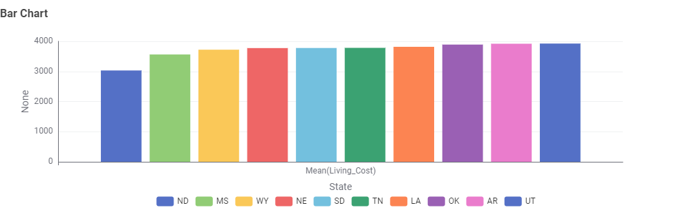
  **Insight:** Analisis Bar Chart memperlihatkan pola geografis yang konsisten untuk biaya hidup terendah:
* **Pusat Wilayah Murah:** Negara bagian dengan biaya terendah terpusat di dua wilayah utama, yaitu **Midwest** (North Dakota, Nebraska, South Dakota) dan **Selatan** (Mississippi, Tennessee, Louisiana, Arkansas, Oklahoma).
* **Geographic Arbitrage:** Kehadiran negara bagian seperti Wyoming dan Utah dalam daftar 10 besar menyoroti peluang bagi mahasiswa untuk mendapatkan kualitas hidup yang tinggi dengan biaya rendah, jauh lebih terjangkau dibandingkan kawasan pesisir padat seperti New York atau California. Temuan ini mengindikasikan bahwa wilayah tengah dan selatan menjadi opsi paling strategis secara finansial bagi mahasiswa dengan anggaran terbatas.

## KESIMPULAN
Analisis ini menyimpulkan bahwa lanskap pendidikan tinggi AS menawarkan *trade-off* yang jelas antara biaya dan performa. Universitas swasta menawarkan peluang kelulusan tertinggi namun dengan biaya yang signifikan, sementara universitas negeri menyediakan akses pendidikan yang terjangkau dengan tingkat keberhasilan yang moderat.

Bagi calon mahasiswa dengan batasan anggaran, strategi terbaik adalah menargetkan universitas negeri yang berlokasi di wilayah Midwest atau Selatan AS. Kombinasi ini menawarkan efisiensi finansial ganda: biaya kuliah (*tuition*) yang lebih rendah dari sektor publik dan penghematan biaya hidup (*living cost*) dari faktor geografis, tanpa harus sepenuhnya mengorbankan kualitas pendidikan.
